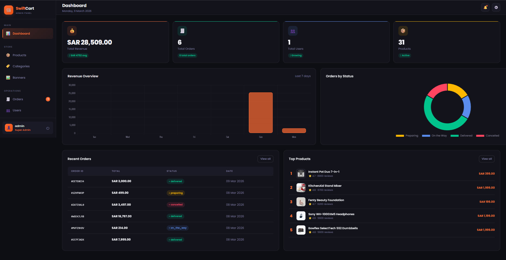
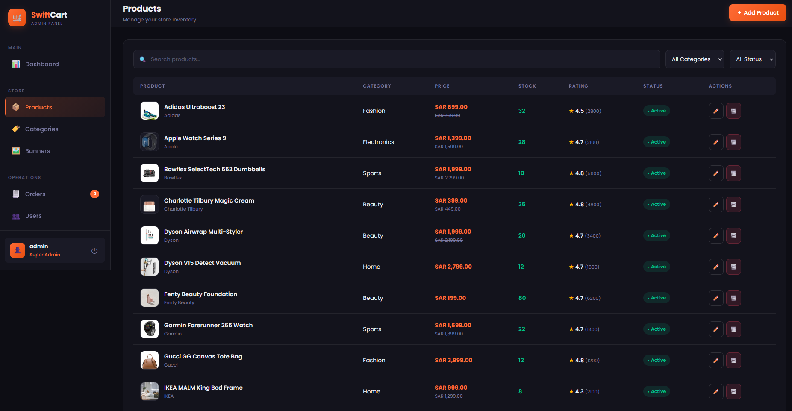
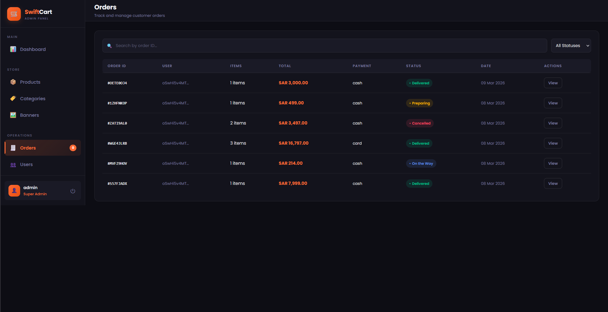
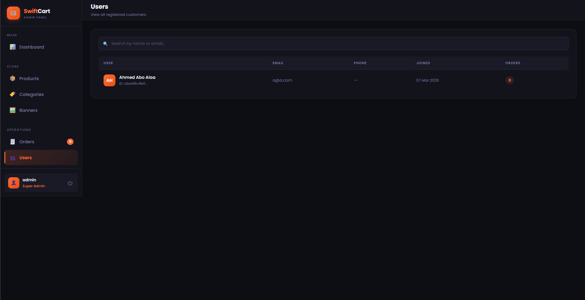
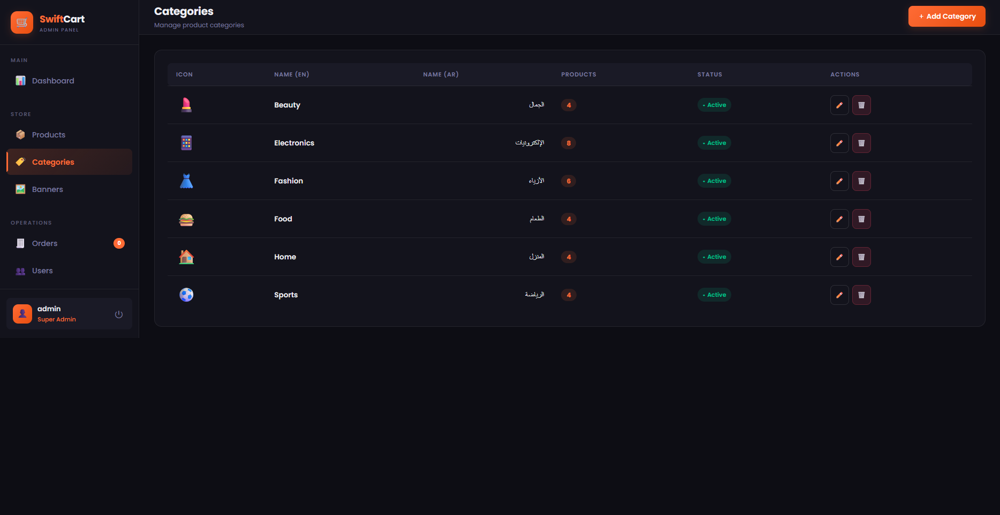
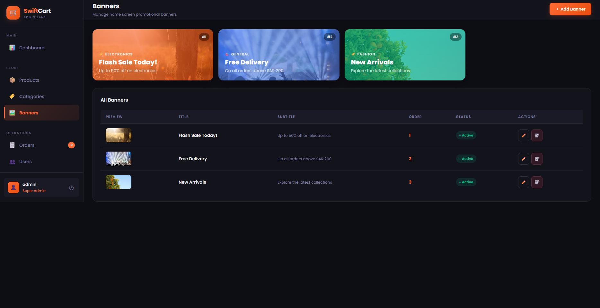

# 🛒 SwiftCart Admin Panel


> A production-ready web admin dashboard to manage the **SwiftCart** Flutter e-commerce application — built with vanilla HTML, CSS & JavaScript connected to Firebase.

[](https://firebase.google.com)
[](https://developer.mozilla.org/en-US/docs/Web/JavaScript)
[](https://developer.mozilla.org/en-US/docs/Web/HTML)
[](LICENSE)

---

## 📸 Screenshots

| Dashboard | Products | Orders |
|-----------|----------|--------|
|  |  |  |

| Users | Categories | Banners |
|-------|------------|---------|
|  |  |  |

---

## ✨ Features

### 📊 Dashboard
- Real-time revenue, orders, users & products stats
- Revenue bar chart (last 7 days) powered by Chart.js
- Orders by status doughnut chart
- Recent orders table
- Top products by review count

### 📦 Products Management
- Full CRUD (Create, Read, Update, Delete)
- Search by name or brand
- Filter by category and status
- Featured & New Arrival toggles
- Discount price support

### 🧾 Orders Management
- View all customer orders in real-time
- Update order status (Preparing → On the Way → Delivered / Cancelled)
- Full order detail modal with items, address, payment method
- Search and filter by status

### 👥 Users
- View all registered customers
- Order count per user
- Search by name or email

### 🏷️ Categories
- Full CRUD with Arabic + English name support
- Emoji icon picker
- Active/Inactive toggle

### 🖼️ Banners
- Live banner preview cards with gradient overlays
- Full CRUD for promotional banners
- Display order management

### 🔐 Authentication
- Firebase Email/Password login
- Session persistence — stays logged in on refresh
- Auth guard on all pages — redirects to login if not authenticated
- Secure logout

---

## 🏗️ Architecture

```
swiftcart-admin/
├── index.html              ← Login page
├── dashboard.html          ← Stats + Charts
├── products.html           ← Products CRUD
├── orders.html             ← Orders management
├── users.html              ← Users list
├── categories.html         ← Categories CRUD
├── banners.html            ← Banners CRUD
│
├── css/
│   ├── main.css            ← Global layout, sidebar, components
│   └── auth.css            ← Login page styles
│
├── js/
│   ├── firebase-config.js  ← Firebase initialization
│   ├── auth.js             ← Auth guard, shared sidebar, utils
│   ├── dashboard.js        ← Stats + Chart.js charts
│   ├── products.js         ← Products CRUD logic
│   ├── orders.js           ← Orders logic + status updates
│   ├── users.js            ← Users list
│   ├── categories.js       ← Categories CRUD
│   └── banners.js          ← Banners CRUD + preview
│
└── assets/
    └── screenshots/        ← App screenshots for README
```

---

## 🛠️ Tech Stack

| Technology | Purpose |
|------------|---------|
| HTML5 + CSS3 | Structure and styling |
| Vanilla JavaScript (ES Modules) | All logic |
| Firebase Auth v10 | Authentication |
| Firebase Firestore v10 | Database |
| Firebase Storage v10 | File storage |
| Chart.js | Revenue + status charts |
| Google Fonts (Poppins) | Typography |

---

## 🚀 Getting Started

### Prerequisites
- A Firebase project (same one used by the SwiftCart Flutter app)
- A modern browser (Chrome, Edge, Firefox)
- Git installed

### 1. Clone the repository

```bash
git clone https://github.com/ahmedaboshowayb-del/swiftcart-admin.git
cd swiftcart-admin
```

### 2. Configure Firebase

Open `js/firebase-config.js` and replace with your Firebase project values:

```javascript
const firebaseConfig = {
  apiKey:            "YOUR_API_KEY",
  authDomain:        "YOUR_PROJECT_ID.firebaseapp.com",
  projectId:         "YOUR_PROJECT_ID",
  storageBucket:     "YOUR_PROJECT_ID.appspot.com",
  messagingSenderId: "YOUR_SENDER_ID",
  appId:             "YOUR_APP_ID"
};
```

> Get these values from: **Firebase Console → Project Settings → General → Your apps**

### 3. Create an Admin User

In Firebase Console:
```
Authentication → Users → Add user
Email:    admin@swiftcart.com
Password: (choose a strong password)
```

### 4. Run locally

Open `index.html` directly in your browser, or use VS Code Live Server:
```
1. Install "Live Server" extension in VS Code
2. Right-click index.html
3. Click "Open with Live Server"
```

### 5. Login

```
URL:      http://localhost:5500
Email:    admin@swiftcart.com  (or the email you created)
Password: your password
```

---

## 🔥 Firebase Firestore Collections

This admin panel reads and writes to these Firestore collections:

| Collection | Description |
|------------|-------------|
| `products` | Product catalog |
| `categories` | Product categories |
| `orders` | Customer orders |
| `users` | Registered users |
| `banners` | Home screen banners |

> **Note:** This admin panel connects to the same Firebase project as the SwiftCart Flutter app.

---

## 🔒 Firestore Security Rules

Make sure your Firestore rules allow admin reads/writes. In Firebase Console → Firestore → Rules:

```javascript
rules_version = '2';
service cloud.firestore {
  match /databases/{database}/documents {

    // Products — public read, admin write
    match /products/{id} {
      allow read: if true;
      allow write: if request.auth != null;
    }

    // Categories — public read, admin write
    match /categories/{id} {
      allow read: if true;
      allow write: if request.auth != null;
    }

    // Banners — public read, admin write
    match /banners/{id} {
      allow read: if true;
      allow write: if request.auth != null;
    }

    // Orders — user-scoped or admin
    match /orders/{id} {
      allow read, write: if request.auth != null;
    }

    // Users — admin only
    match /users/{id} {
      allow read, write: if request.auth != null;
    }
  }
}
```

---

## 📱 Related Project

This admin panel manages the **SwiftCart Flutter App**:

🔗 [SwiftCart Flutter App](https://github.com/ahmedaboshowayb-del/swiftcart)

| Feature | Flutter App | Admin Panel |
|---------|-------------|-------------|
| View products | ✅ | ✅ |
| Manage products | ❌ | ✅ |
| Place orders | ✅ | ❌ |
| Manage orders | ❌ | ✅ |
| User registration | ✅ | ❌ |
| View users | ❌ | ✅ |
| View banners | ✅ | ✅ |
| Manage banners | ❌ | ✅ |

---

## 🎨 Design System

| Token | Value |
|-------|-------|
| Primary | `#FF6B35` (Orange) |
| Background | `#0D0D14` |
| Surface | `#13131C` |
| Text | `#F0F0F5` |
| Success | `#00C48C` |
| Warning | `#FFB800` |
| Error | `#FF4560` |
| Font | Poppins (Google Fonts) |

---

## 📋 Pages Overview

| Page | Route | Description |
|------|-------|-------------|
| Login | `index.html` | Firebase auth login |
| Dashboard | `dashboard.html` | Stats, charts, recent data |
| Products | `products.html` | Full product management |
| Orders | `orders.html` | Order tracking + status |
| Users | `users.html` | Customer list |
| Categories | `categories.html` | Category management |
| Banners | `banners.html` | Promotional banners |

---

## 🤝 Contributing

Pull requests are welcome. For major changes, please open an issue first.

---

## 📄 License

This project is licensed under the MIT License.

---

## 👨‍💻 Author

**Ahmed Abo showayb**

[](https://github.com/ahmedaboshowayb-del)

---

<div align="center">
  <p>Built with ❤️ using Firebase + Vanilla JS</p>
  <p>⭐ Star this repo if you found it useful!</p>
</div>
